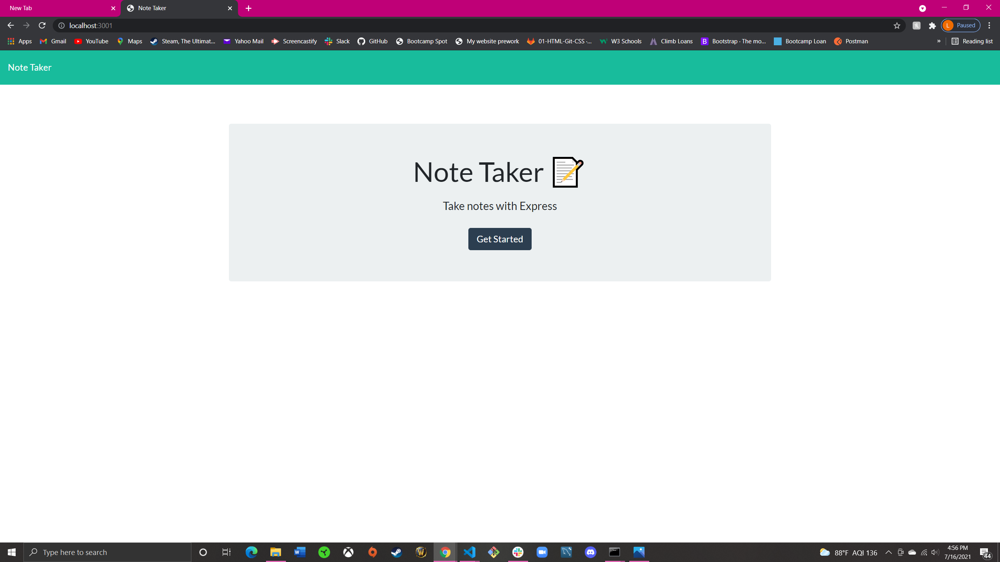

# Note Taker App

An app using Express.js back end and json files to take and save notes! 

# Heroku 
Deployed on Heroku.com as well

https://fierce-falls-47255.herokuapp.com/


## Technology Used
* Express.js
* Node.js
* json 

## Usage

To start install required packages in your terminal

``` 
npm init -y 

npm i express
``` 
To give each note a unique id install uniqid
``` 
npm i uniqid
```

To start the server 

```
node server.js
``` 
Then copy the http:// given and the app is ready to use!

## App 



## References 

For unique ids for each note:
https://www.npmjs.com/package/uniqid

